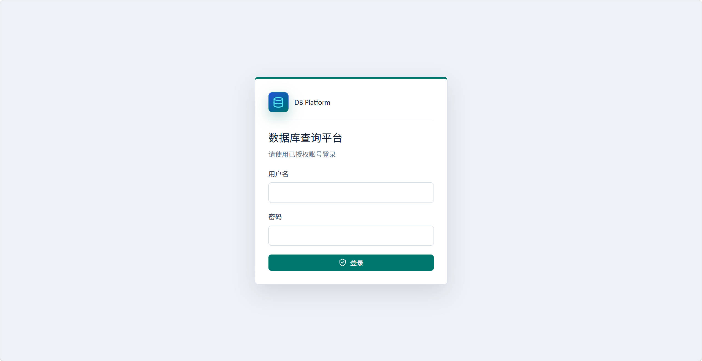
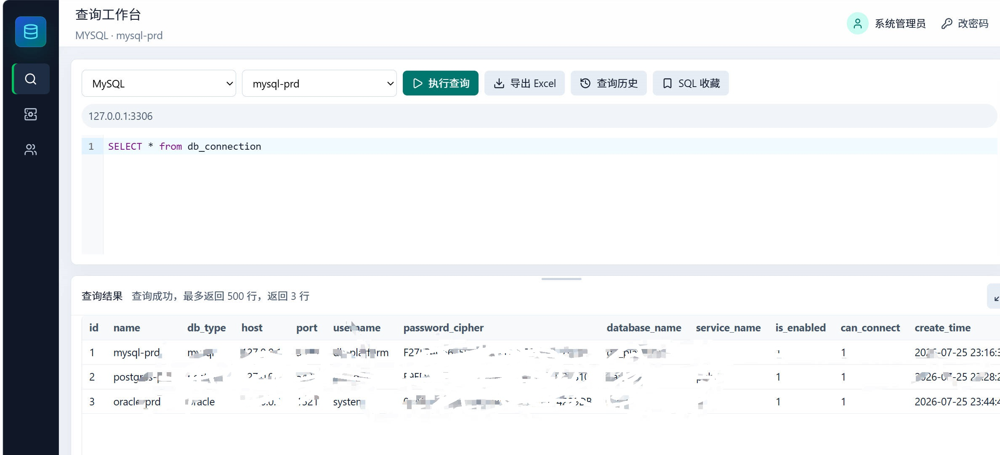
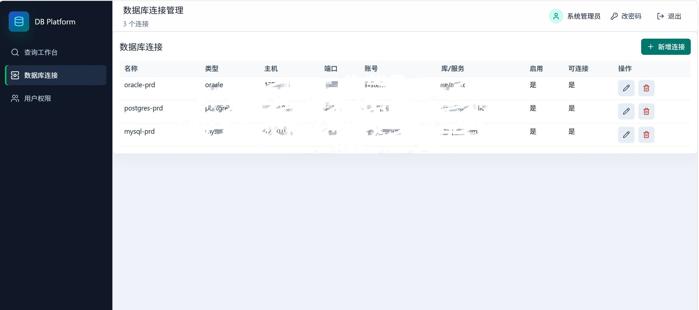
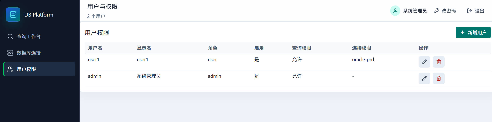

# 数据库查询平台

基于 Go (Gin) 和 Vue 3 构建的轻量级数据库查询平台，面向受控的只读 SQL 查询场景。平台只保留用户认证、用户权限、数据库连接管理、查询工作台、元数据浏览、查询历史、Excel 导出和 SQL 收藏夹。

## 功能

### 用户认证

- 账号密码登录
- 退出登录
- 获取当前登录用户
- 修改密码
- 首次登录强制改密
- 首次打开页面先校验会话，未登录或会话失效时统一显示固定登录页

### 用户与权限

- 管理员维护用户
- 支持 `admin` / `user` 角色
- 管理员为普通用户分配可访问的数据库连接
- 普通用户只能看到并查询已授权连接

### 数据库连接管理

- 管理员配置 MySQL / Oracle / PostgreSQL / MSSQL 连接
- Oracle 连接填写服务名，可选填写 schema 名
- PostgreSQL 连接填写数据库名，可选填写 schema 名
- MSSQL 连接方式与 MySQL 一样，填写数据库名即可
- 支持连接新增、编辑、删除
- 支持连接测试
- 支持启用/禁用连接
- 支持 `can_connect` 标记，不可连接的库不允许查询

### 查询工作台

- 只允许执行 `SELECT` / `WITH` 开头的查询
- 禁止多语句执行
- 查询层最多返回 500 行
- 支持 MySQL / Oracle / PostgreSQL / MSSQL
- 支持 SQL 关键字、元数据和表别名字段提示
- 支持 `Ctrl + Enter` 执行查询和一键清空编辑器
- 查询结果在编辑器与元数据区域下方全宽展示，可调整高度、隐藏或最大化
- 每页支持显示 20 / 50 / 100 行
- 支持 Excel `.xlsx` 导出

### 元数据与辅助能力

- 浏览表和字段元数据
- 根据关键字查询表名、字段名和注释
- 点击表名/字段名插入 SQL 编辑区
- 右侧元数据栏支持折叠，并记住用户最后一次折叠状态
- 查询历史按登录用户保存在浏览器 `localStorage`，仅保留最近 20 条有返回数据的记录
- SQL 收藏夹支持保存、编辑、删除和复用
- 查询历史可一键加入 SQL 收藏夹

## 安全边界

- 查询、元数据、Excel 导出和收藏接口必须登录后访问
- 用户只能使用管理员分配的数据库连接；管理员可以使用全部启用连接
- 服务端只接受单条 `SELECT` / `WITH` 查询，并统一限制最多返回 500 行
- 应用层阻止显式跨范围查询：MySQL 跨数据库、PostgreSQL/Oracle 跨 schema、MSSQL 跨数据库和 linked server
- schema、`search_path` 和默认数据库不是数据库权限边界，目标数据库账号仍必须遵循最小权限原则
- 建议每个连接使用专用只读账号，只授予目标库/schema 的对象查询权限，不要配置 root、SYS、sa 或其他高权限账号
- API 响应使用 `Cache-Control: no-store`，避免退出后浏览器复用旧的认证或业务数据

## 技术栈

### 后端

- Go
- Gin
- MySQL 管控库
- MySQL 查询驱动：`go-sql-driver/mysql`
- Oracle 查询驱动：`sijms/go-ora/v2`
- PostgreSQL 查询驱动：`lib/pq`
- MSSQL 查询驱动：`go-mssqldb`
- Excel 导出：`xuri/excelize`
- 前端静态资源通过 Go `embed` 嵌入

### 前端

- Vue 3
- TypeScript
- Vite
- CodeMirror 6
- Lucide 图标
- 原生 CSS

## 数据库表

| 表名                 | 说明                 |
| -------------------- | -------------------- |
| `user`               | 平台用户表           |
| `session`            | 登录会话表           |
| `db_connection`      | 数据库连接配置表     |
| `user_db_connection` | 用户与连接权限关系表 |
| `sql_favorite`       | SQL 收藏表           |

## 目录结构

```text
db_platform/
├── client/                    # Vue 前端
│   ├── src/
│   │   ├── App.vue            # 查询平台单页应用
│   │   └── main.ts            # 前端入口
│   ├── package.json
│   └── vite.config.ts
├── server/                    # Go 后端
│   ├── auth/                  # 登录会话与鉴权中间件
│   ├── config/                # 管控库配置
│   ├── routes/                # API 与静态资源路由
│   ├── sql/                   # 查询、连接、用户、收藏业务逻辑
│   ├── web/dist/              # 前端构建产物
│   ├── logs/                  # 默认访问日志目录，首次启动时自动创建
│   ├── main.go
│   └── go.mod
├── init.sql                   # 初始化 SQL
└── README.md
```

## 本地运行

### 1. 初始化数据库

```bash
调整加密函数fixed_aes_encrypt，fixed_aes_decrypt中的32位密钥，以及管理员admin的默认密码
mysql -u root -p < init.sql
```

### 2. 配置后端

修改 `server/config/platform_db.go` 中的管控库连接配置：

```go
const (
    PlatformDBHost     = "你的数据库IP"
    PlatformDBPort     = 3306
    PlatformDBUser     = "db_platform"
    PlatformDBPassword = "你的密码"
    PlatformDBName     = "db_platform"
)
```

### 3. 编译前端

```bash
cd client
npm install
npm run build
```

构建结果会输出到 `server/web/dist`。

### 4. 运行后端

```bash
cd server
go run .
```

默认端口为 `1520`，访问 `http://localhost:1520`。

可通过环境变量修改端口：

```bash
PORT=8080 go run .
```

### 5. 编译后端

Linux / macOS：

```bash
cd server
go build -o db-platform .
./db-platform
```

Windows PowerShell：

```powershell
cd server
go build -o db-platform.exe .
./db-platform.exe
```

前端资源通过 Go `embed` 编译进可执行文件，因此修改前端后需要先执行 `npm run build`，再重新编译后端。

## 访问日志

- 程序启动时会自动创建默认目录 `logs` 和当天文件，例如 `logs/access-2026-07-26.log`，无需提前手工创建
- 默认路径相对于程序启动时的工作目录；生产环境可使用 `LOG_DIR` 指定固定日志目录
- 如果目录不存在会递归创建；如果目录不可写，程序会在启动阶段直接报错
- 仅记录 `/api/` 请求的时间、客户端 IP、方法、路径、状态码、耗时和 User-Agent，不记录请求体及密码
- 按本地日期每天写入一个文件；服务跨过午夜后会自动切换，不需要重启
- 每次启动和日期切换时会清理超过 14 天的访问日志

Linux / macOS 指定日志目录：

```bash
LOG_DIR=/var/log/db-platform ./db-platform
```

Windows PowerShell 指定日志目录：

```powershell
$env:LOG_DIR = "D:\\db-platform-logs"
./db-platform.exe
```

## 默认管理员

- 用户名：`admin`
- 密码：`Admin`

首次部署后请立即修改默认管理员密码。

## 验证

```bash
cd client && npm run build
cd server && go test ./...
```
